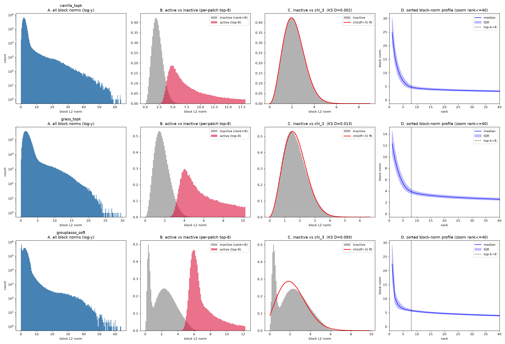
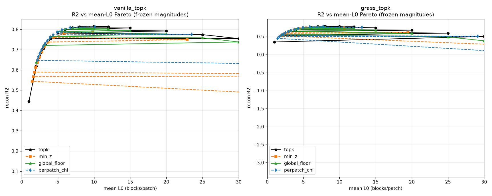
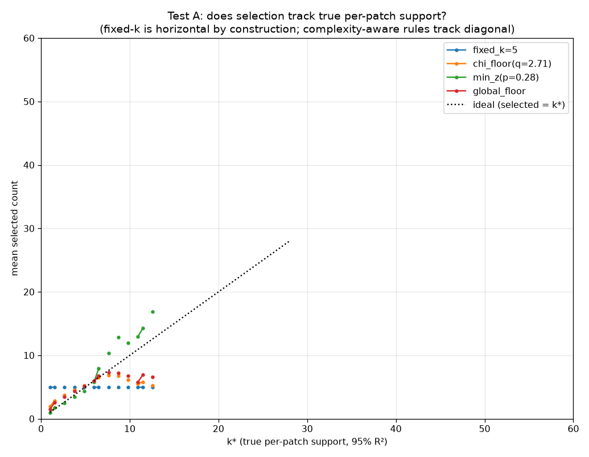

# Distribution-Aware Block Selection for Block-Sparse Featurizers

**TL;DR: We ported the min-p / top-nσ family of adaptive truncation samplers onto block selection in Goodfire's Block-Sparse Featurizer (BSF), found that the *sampling* intuitions mostly don't transfer directly — and that the thing that actually works is per-input **FDR control against a measured χ₃ noise null**. One evening of experiments, honest negatives included.**

*Status: exploratory (2026-07-09 → 07-11). Fork of [goodfire-ai/block-sparse-featurizer](https://github.com/goodfire-ai/block-sparse-featurizer); all our work is in `experiments/`. Author: Minh Nguyen (min-p, arXiv:2407.01082) + agent-assisted execution. Related: [top_nsigma repo](https://github.com/menhguin/top_nsigma).*

## Exec summary: why we settled on per-input BH-FDR (vs the alternatives)

Every selection rule we tested is secretly answering the same question — *"how many blocks does this input deserve?"* — and they differ only in what they **reference** to decide. Working through the candidates, each alternative died or fell short for a specific, measurable reason. **Max-referenced** rules (min-z, the literal min-p port; the anchor half of top-nσ) assume the top score is trustworthy signal — true for logits, false for dictionary codes, where the max-norm block is frequently a generic/positional artifact; min-z lost 10× more R² than noise-referenced selection and its Pareto curve *declines* as you loosen it. **Gap/curvature** rules (DiffSampling, Min-k-style knee detection) assume a visible signal/noise cliff; the sorted norm profiles are a smooth continuum at both aggregate and per-patch level, and gap-cutting correlates ~0.04 with true support (≈ random). **Entropy-referenced** rules (Top-H, and by extension η-sampling/ACS/GUARD) assume entropy tracks concept count; in norm-space it *anti*-correlates (−0.53), because complex patches spread energy and saturate a renormalized-entropy budget *faster*, selecting fewer blocks exactly when more are needed. **Participation-ratio** (p-less, zero hyperparameters) is the best pure *ranking* statistic we found (corr 0.70 with true support) but its mathematically-forced operating point over-selects ~2.6× — great shape, uncalibrated scale, and "fixing" the scale with a multiplier would just reintroduce an arbitrary constant. **Heuristic noise-floor thresholds** (our χ-floor, q·σ̂) perform well but the multiplier q is still a benchmark-tuned magic number with no meaning off-dataset, and its budget-targeting is unstable under co-adapted training. What survives all of these failure modes is the statistics-textbook move: we *measured* that inactive-block norms follow a χ₃ null almost exactly (KS D=0.0019, group-size-3 blocks → norm of a 3-d Gaussian), which turns "is this block active?" into a literal hypothesis test — per-block p-values, then **Benjamini-Hochberg per input** to select a variable-size set at target false-discovery rate α. That knob is the entire argument: α isn't a magnitude or a fraction tuned to look good on rabbits, it's a dimensionless error tolerance ("~10% false-active blocks") that means the same thing on any input, any dataset, any encoder. Empirically, *untuned* α=0.10 tracks true support better (corr 0.62) than the *tuned* χ-floor (0.576), and when frozen after calibration on simple patches it auto-widens its selection on complex ones (and vice versa), cutting selection error 40-67% where fixed-k stays stuck at its calibration count by construction. We chose BH over the fancier FDR machinery deliberately: Model-X knockoffs (the Enkhbayar 2025 route for SAEs) exist to *manufacture* a null when you can't write one down and operate dataset-level/supervised — we have a measured null and a per-input/unsupervised problem — and the dependence-robust BY correction turned out to select identical sets, so plain BH suffices. In short: **BH-FDR won because it's the only candidate whose single knob is grounded in the one thing we can actually verify about this system (the noise distribution), rather than in whatever number happened to score well.**

---

## The motivating problem

BSF decomposes vision-model activations (DINOv3 patch tokens) into ~256 concept "blocks" (3-dim subspaces, so concepts are manifolds not directions). Per input patch, each block gets an L2 norm; the stock method keeps the **fixed top-k=8** largest-norm blocks and reconstructs from those.

If you know sampling, you already see it: **block top-k is top-k sampling.** The true number of concepts in a patch is a latent random variable (a blank-sky patch has ~2, a rabbit-ear patch has ~12 — we measure per-patch true support CV ≈ 0.31), but the selection rule spends a *constant* 8 on every patch. Fixed-count selection over-selects on simple inputs (admits noise blocks, which then get *trained* on inputs where their concept is absent — a monosemanticity tax) and truncates on complex ones (drops real concepts). This is precisely the pathology min-p was built to fix for logits. Also: **k=8 is never justified anywhere in the BSF repo** (README uses 16, notebooks use 8, no rationale), and we verify it cuts a smooth continuum (rank-8 vs rank-9 norms differ ~5%).

| LLM sampling | BSF block selection |
|---|---|
| logits over 128k-token vocab | pre-gate L2 norms over 256 blocks |
| truncation sampler picks surviving tokens | selector picks active blocks |
| top-k sampling (fixed count) | **stock BSF block top-k=8** |
| min-p / top-nσ (shape-adaptive count) | this work |

So: can we transplant distribution-aware truncation? And more importantly — *what's the principled way to set the threshold* so the knob isn't just another benchmark-tuned magic number?

## What we tried, in order (with the failures kept in)

Everything runs on the repo's 300 rabbit images → DINOv3 ViT-B/16 patch activations (58.8k patches × 768d) → Vanilla/Grassmannian BSF (256 blocks × group-size 3). Scripts numbered in `experiments/scripts/`, one findings doc per experiment in `experiments/results/`.

### 0. Measure the distribution first (`02_measure...`, `FINDINGS.md`)
Not bimodal — 256 blocks don't separate like a 128k vocab. **But inactive-block norms fit a χ distribution with df=3 near-perfectly (KS D=0.0019).** Group-size-3 blocks → inactive norm = norm of a 3d near-Gaussian → χ₃. Training *manufactures* a clean noise null (reconstruction pressure pushes inactive blocks toward zero) — the thing the top-nσ paper could only assume about logits, BSF gives you for free, measurably.



### 1-3. Three clean negatives (E1, E2, monosemanticity)
- **E1** (`03_pareto...`): on frozen top-k-trained magnitudes, every adaptive selector loses to top-k at matched mean-L0. Partially a rigged test (magnitudes co-adapted to top-k), but the *internal ordering* is the signal: **noise-referenced (χ-floor) ties top-k at −0.003 R²; max-referenced (min-z, the literal min-p port) loses 10× worse (−0.03) and its Pareto curve *declines* with more blocks.** The max block-norm is often a generic/positional artifact — the max is an untrustworthy anchor here, the exact *opposite* of logit sampling where the max is the model's best guess. **Max-referencing is dead in this domain.**
- **E2** (`04_robustness...`): trained χ-floor selection in the loop, swept train×eval operating points. **top-k(8) is the most robust single model** — the temperature-invariance analogy breaks because sparsity budget is a *train-time* property (baked into the dictionary), not an eval-time transform. Also χ-floor's q→L0 map is chaotic under co-adaptation (budget targeting is unstable).
- **Monosemanticity** (`05b_...`): at matched L0, χ-floor wins all 4 feature-quality metrics (passenger-firing rate, selectivity, top-firing input coherence) but every margin is within noise.



**Interim verdict: on in-distribution aggregate metrics, distribution-aware selection is a reparameterization, not a win.**

### 4. The reframe that found the real signal (Test A, `06_testA...`)
Aggregate R² *averages over* the complexity distribution — fixed-k's errors on simple and complex patches cancel in the mean. So measure **selection correctness** instead: define per-patch true support k* = min blocks reaching 95% of that patch's own *peak* R² (peak, not full-256 — the overcomplete non-orthogonal decoder makes per-patch R² peak ~k=10 then *decline*, which is also why flooding blocks in hurts). k*: mean 5.4, CV 0.31.

At matched mean-selected-count: **fixed-k is flat (corr 0 with k*, by construction); χ-floor tracks true support (corr 0.58) with −21% total selection error. Fixed-k's errors live entirely on the tails: over-selects simple patches by +1.5 blocks, truncates complex ones by −1.8, ~zero error at the mean it was tuned to.** The value of adaptive selection is complexity-tracking/robustness — invisible to the R² average. (Same shape as min-p's actual value being robustness, not benchmark wins.)



### 5. Port the wider sampler family (`07_testA_extended...`)
Scored against the same k* ground truth:
- **p-less** (collision probability / participation ratio, zero hyperparams): **best support-ranking of anything tested (corr 0.695)** — 1/Σp² is literally an effective-support estimator — but its fixed operating point over-selects 2.6×. Great shape, wrong scale.
- **DiffSampling** (largest sorted-gap cut): corr 0.04 ≈ random. There are no cliffs in these norm profiles, per-patch or aggregate. Gap-detection is dead here.
- **Top-H** (entropy-budget): corr **−0.53, anti-correlated.** Complex patches spread energy → renormalized entropy saturates *fast* → selects *fewer*. **Shannon entropy of norm profiles is not a concept-count proxy in BSF** — which indicts the whole entropy-referenced family (η-sampling, ACS, GUARD) for this domain.

### 6. The principled-threshold question → FDR (`08_fdr_v1...`)
The real question behind all of this: *what makes a threshold non-arbitrary?* Our answer after a deep lit review (report in `results/`): **express the knob as an error rate against a null model.** We have a measured χ₃ null → per-block p-values → **per-patch Benjamini-Hochberg at target FDR α**. Each patch gets its own step-up cutoff (variable-size selection); α is dimensionless ("I tolerate ~10% false-active blocks") and carries the same meaning on any dataset.

Result: **untuned α=0.10 hits corr 0.62 with k*** — second-best support-tracking of anything tested, above the *tuned* χ-floor (0.576) — **with zero benchmark tuning.** BH ≡ Benjamini-Yekutieli here (block dependence isn't distorting selection). Nearest prior art: Enkhbayar 2025 (arXiv:2511.11711) applies Model-X knockoffs to SAE features — but that's supervised, dataset-level, with a *manufactured* Gaussian-surrogate null; ours is unsupervised, per-input, with a *measured* null. Knockoffs are the tool for when you can't write the null down; we can.

### 7. Transfer tests (`09_testB...`, `10_testB2...`) — one honest faceplant, one clean win
- **Test B (confounded, kept for honesty):** froze rabbit-calibrated knobs, applied the *rabbit-trained dictionary* to Imagenette. Everything failed — because the dictionary reconstructs Imagenette at R²=0.15 vs 0.81 native (no chainsaw concepts in a rabbit dictionary; norm contrast collapses 11.8→3.4). The selectors did the statistically correct thing on garbage input. Lesson: rule-transfer and dictionary-transfer must be separated.
- **Test B″ (clean):** within-rabbit complexity split (LOW k*=4.2 / HIGH k*=6.8), same dictionary both sides, calibrate knob on one half, **freeze**, test on the other. **Adaptive rules cut selection error 40-67% vs fixed-k and move the count the right way with a frozen knob** (calibrated-on-simple BH widens 4→5.5 on complex; calibrated-on-complex narrows 7→4.9 on simple, corr 0.60). Fixed-k stays stuck at its calibration count, wrong by ~2.8 blocks on the other half — structurally, by construction. **First clean evidence the α-knob transfers across a complexity gap where fixed-count can't.**

## Current state + what we'd ask you

**Standing claims:** (1) max-referenced selection dies in dictionary-code space (untrustworthy max); (2) BSF training manufactures a *measurable* χ₃ noise null → concept membership is a well-posed hypothesis test; (3) adaptive selection buys nothing on in-distribution aggregate R² but is substantially more selection-correct on the complexity tails; (4) per-patch BH-FDR on χ p-values matches tuned heuristics with an untuned, dimensionless α; (5) the α-knob transfers across complexity shifts (B″) where fixed-k structurally can't.

**Known gaps (not yet done):** domain-shift transfer with a *competent* dictionary (broad-trained dictionary, calibrate-on-simple-classes/test-on-complex — "B‴"); a real realized-FDR calibration check (our proxy saturated; needs synthetic-null injection to verify α actually delivers ~α false actives); bit-for-bit rerun on gated `facebook/dinov3-*` weights (current numbers use the identical-checkpoint timm mirror); comparison on the Grassmannian variant + the paper's other settings (InceptionV1, SDXL).

**Things we'd genuinely like a sampling person's read on:** does the "measured-null FDR > ported-sampler-heuristics" framing hold up, or are we missing a sampler-family that should survive here? Is the entropy-anti-correlation finding (Top-H backwards in norm-space) surprising to you or obvious in hindsight? And is there an argument *for* max-anchoring in dictionary codes we haven't considered?

## Repro

```bash
uv venv --python 3.12 .venv && source .venv/bin/activate
uv pip install -e . && uv pip install timm scipy
python experiments/scripts/00_dino_activations.py    # one-time, caches acts.npy
python experiments/scripts/01_train_baselines.py     # 3 substrates, ~20 min MPS
python experiments/scripts/02_measure_distributions.py
python experiments/scripts/06_testA_complexity.py    # the k* harness
python experiments/scripts/08_fdr_v1.py              # the FDR result
python experiments/scripts/10_testB2_complexity_split.py  # the transfer win
```
Heavy artifacts (activations `.npy`, model `.pt`) are gitignored — regenerated by the scripts above. Detailed per-experiment writeups: `results/FINDINGS*.md`. Full progress narrative: `PROGRESS.md`. A 20-method catalogue of the min-p-descendant sampler family mapped to BSF ports (with portability verdicts): `results/sampling_methods_catalogue.md`.
